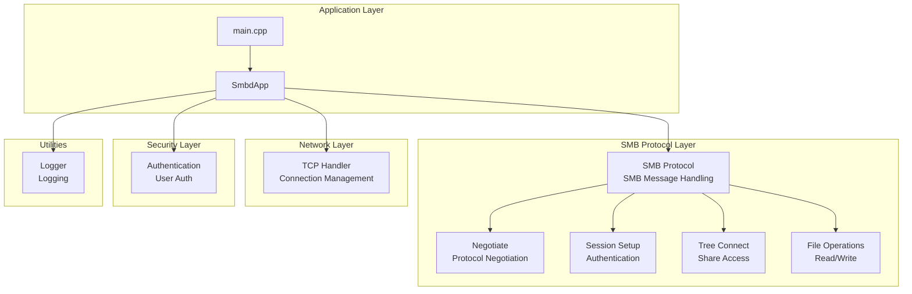
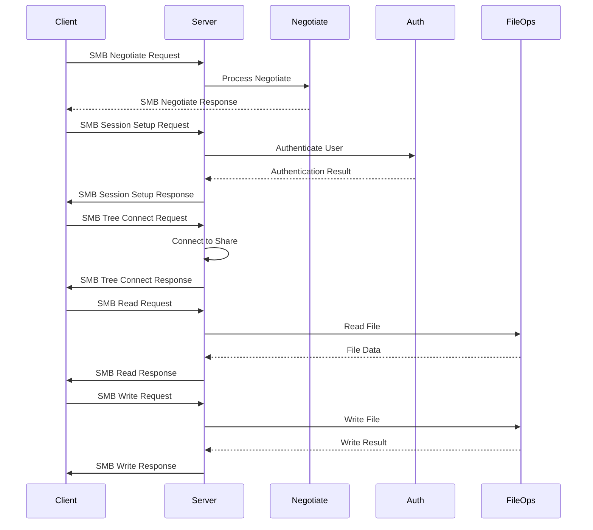

# Simple SMB Daemon - Architecture Diagrams

## System Architecture

```mermaid
graph TB
    subgraph "Application Layer"
        Main[main.cpp]
        App[SmbdApp]
    end
    
    subgraph "SMB Protocol Layer"
        SMBProtocol[SMB Protocol<br/>SMB Message Handling]
        Negotiate[Negotiate<br/>Protocol Negotiation]
        SessionSetup[Session Setup<br/>Authentication]
        TreeConnect[Tree Connect<br/>Share Access]
        FileOps[File Operations<br/>Read/Write]
    end
    
    subgraph "Network Layer"
        TCPHandler[TCP Handler<br/>Connection Management]
    end
    
    subgraph "Security Layer"
        Auth[Authentication<br/>User Auth]
    end
    
    subgraph "Utilities"
        Logger[Logger<br/>Logging]
    end
    
    Main --> App
    App --> SMBProtocol
    App --> TCPHandler
    App --> Auth
    App --> Logger
    
    SMBProtocol --> Negotiate
    SMBProtocol --> SessionSetup
    SMBProtocol --> TreeConnect
    SMBProtocol --> FileOps
```

## SMB Session Flow

```mermaid
sequenceDiagram
    participant Client
    participant Server
    participant Negotiate
    participant Auth
    participant FileOps
    
    Client->>Server: SMB Negotiate Request
    Server->>Negotiate: Process Negotiate
    Negotiate-->>Client: SMB Negotiate Response
    
    Client->>Server: SMB Session Setup Request
    Server->>Auth: Authenticate User
    Auth-->>Server: Authentication Result
    Server->>Client: SMB Session Setup Response
    
    Client->>Server: SMB Tree Connect Request
    Server->>Server: Connect to Share
    Server->>Client: SMB Tree Connect Response
    
    Client->>Server: SMB Read Request
    Server->>FileOps: Read File
    FileOps-->>Server: File Data
    Server->>Client: SMB Read Response
    
    Client->>Server: SMB Write Request
    Server->>FileOps: Write File
    FileOps-->>Server: Write Result
    Server->>Client: SMB Write Response
```

