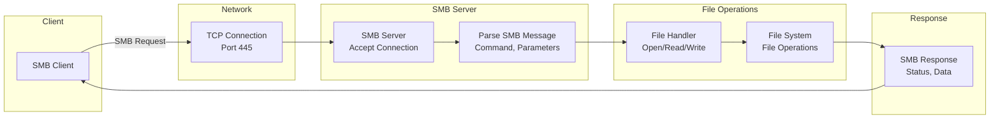

# Simple SMB Daemon - Data Flow Diagrams

## SMB Protocol Data Flow

```mermaid
flowchart LR
    subgraph "Client"
        C1[SMB Client]
    end

    subgraph "Network"
        N1[TCP Connection<br/>Port 445]
    end

    subgraph "SMB Server"
        S1[SMB Server<br/>Accept Connection]
        S2[Parse SMB Message<br/>Command, Parameters]
    end

    subgraph "File Operations"
        FO1[File Handler<br/>Open/Read/Write]
        FO2[File System<br/>File Operations]
    end

    subgraph "Response"
        R1[SMB Response<br/>Status, Data]
    end

    C1 -->|SMB Request| N1
    N1 --> S1
    S1 --> S2
    S2 --> FO1
    FO1 --> FO2
    FO2 --> R1
    R1 --> C1
```
