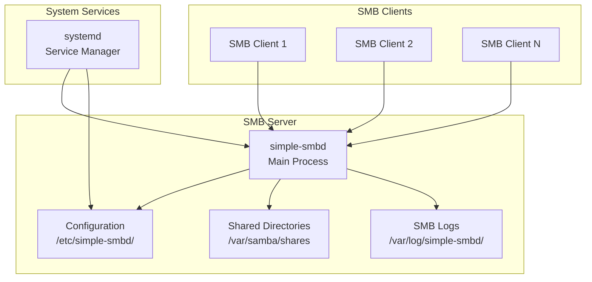

# Simple SMB Daemon - Deployment Diagrams

## Basic Deployment Architecture

```mermaid
graph TB
    subgraph "SMB Clients"
        Client1[SMB Client 1]
        Client2[SMB Client 2]
        ClientN[SMB Client N]
    end

    subgraph "SMB Server"
        Server[simple-smbd<br/>Main Process]
        Config[Configuration<br/>/etc/simple-smbd/]
        Shares[Shared Directories<br/>/var/samba/shares]
        Logs[SMB Logs<br/>/var/log/simple-smbd/]
    end

    subgraph "System Services"
        Systemd[systemd<br/>Service Manager]
    end

    Client1 --> Server
    Client2 --> Server
    ClientN --> Server

    Systemd --> Server
    Systemd --> Config

    Server --> Config
    Server --> Shares
    Server --> Logs
```
