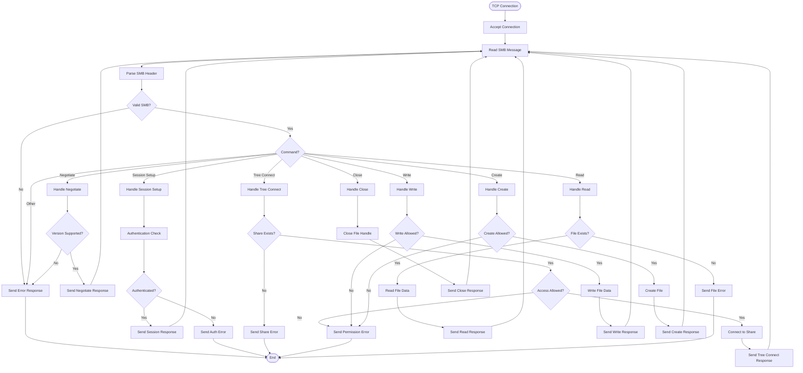

# Simple SMB Daemon - Flow Diagrams

## SMB Protocol Flow

```mermaid
flowchart TD
    Start([TCP Connection]) --> Accept[Accept Connection]
    Accept --> ReadSMB[Read SMB Message]
    ReadSMB --> Parse[Parse SMB Header]
    Parse --> Validate{Valid SMB?}
    Validate -->|No| SendError[Send Error Response]
    Validate -->|Yes| CheckCommand{Command?}
    
    CheckCommand -->|Negotiate| HandleNegotiate[Handle Negotiate]
    CheckCommand -->|Session Setup| HandleSession[Handle Session Setup]
    CheckCommand -->|Tree Connect| HandleTree[Handle Tree Connect]
    CheckCommand -->|Read| HandleRead[Handle Read]
    CheckCommand -->|Write| HandleWrite[Handle Write]
    CheckCommand -->|Create| HandleCreate[Handle Create]
    CheckCommand -->|Close| HandleClose[Handle Close]
    CheckCommand -->|Other| SendError
    
    HandleNegotiate --> CheckVersion{Version Supported?}
    CheckVersion -->|Yes| SendNegotiate[Send Negotiate Response]
    CheckVersion -->|No| SendError
    
    HandleSession --> AuthCheck[Authentication Check]
    AuthCheck --> AuthOK{Authenticated?}
    AuthOK -->|No| SendAuthError[Send Auth Error]
    AuthOK -->|Yes| SendSession[Send Session Response]
    
    HandleTree --> CheckShare{Share Exists?}
    CheckShare -->|No| SendShareError[Send Share Error]
    CheckShare -->|Yes| CheckPerm{Access Allowed?}
    CheckPerm -->|No| SendPermError[Send Permission Error]
    CheckPerm -->|Yes| ConnectShare[Connect to Share]
    ConnectShare --> SendTree[Send Tree Connect Response]
    
    HandleRead --> CheckFile{File Exists?}
    CheckFile -->|No| SendFileError[Send File Error]
    CheckFile -->|Yes| ReadFile[Read File Data]
    ReadFile --> SendRead[Send Read Response]
    
    HandleWrite --> CheckWritePerm{Write Allowed?}
    CheckWritePerm -->|No| SendPermError
    CheckWritePerm -->|Yes| WriteFile[Write File Data]
    WriteFile --> SendWrite[Send Write Response]
    
    HandleCreate --> CheckCreatePerm{Create Allowed?}
    CheckCreatePerm -->|No| SendPermError
    CheckCreatePerm -->|Yes| CreateFile[Create File]
    CreateFile --> SendCreate[Send Create Response]
    
    HandleClose --> CloseFile[Close File Handle]
    CloseFile --> SendClose[Send Close Response]
    
    SendError --> End([End])
    SendAuthError --> End
    SendShareError --> End
    SendPermError --> End
    SendFileError --> End
    SendNegotiate --> ReadSMB
    SendSession --> ReadSMB
    SendTree --> ReadSMB
    SendRead --> ReadSMB
    SendWrite --> ReadSMB
    SendCreate --> ReadSMB
    SendClose --> ReadSMB
```

