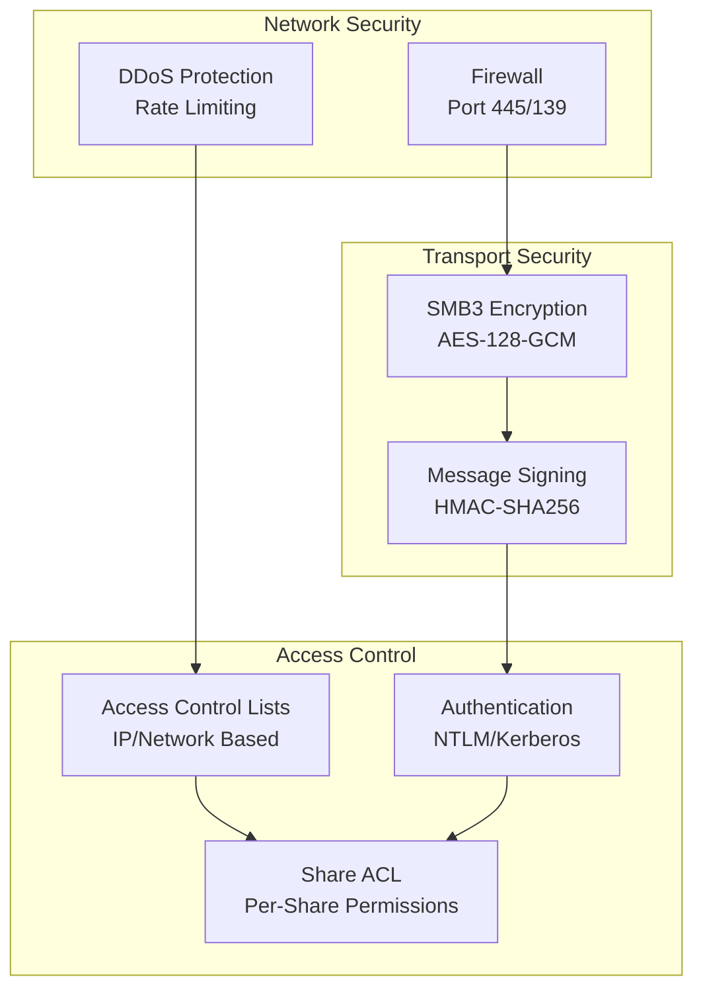
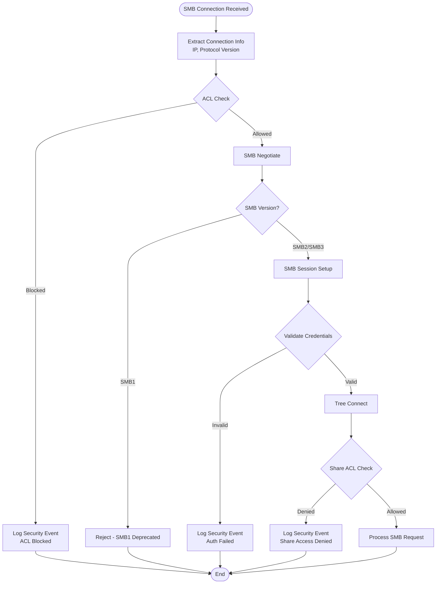

# Simple SMB Daemon - Security Diagrams

## Security Architecture

```mermaid
graph TB
    subgraph "Network Security"
        Firewall[Firewall<br/>Port 445/139]
        DDoSProtection[DDoS Protection<br/>Rate Limiting]
    end

    subgraph "Transport Security"
        SMB3[SMB3 Encryption<br/>AES-128-GCM]
        Signing[Message Signing<br/>HMAC-SHA256]
    end

    subgraph "Access Control"
        ACL[Access Control Lists<br/>IP/Network Based]
        Auth[Authentication<br/>NTLM/Kerberos]
        ShareACL[Share ACL<br/>Per-Share Permissions]
    end

    Firewall --> SMB3
    DDoSProtection --> ACL

    SMB3 --> Signing
    Signing --> Auth

    ACL --> ShareACL
    Auth --> ShareACL
```

## Security Flow

```mermaid
flowchart TD
    Start([SMB Connection Received]) --> ExtractInfo[Extract Connection Info<br/>IP, Protocol Version]

    ExtractInfo --> ACLCheck{ACL Check}
    ACLCheck -->|Blocked| LogBlock1[Log Security Event<br/>ACL Blocked]
    ACLCheck -->|Allowed| NegotiateCheck

    NegotiateCheck[SMB Negotiate] --> VersionCheck{SMB Version?}
    VersionCheck -->|SMB1| RejectSMB1[Reject - SMB1 Deprecated]
    VersionCheck -->|SMB2/SMB3| AuthCheck

    AuthCheck[SMB Session Setup] --> ValidateAuth{Validate Credentials}
    ValidateAuth -->|Invalid| LogBlock2[Log Security Event<br/>Auth Failed]
    ValidateAuth -->|Valid| ShareCheck

    ShareCheck[Tree Connect] --> ShareACLCheck{Share ACL Check}
    ShareACLCheck -->|Denied| LogBlock3[Log Security Event<br/>Share Access Denied]
    ShareACLCheck -->|Allowed| ProcessRequest

    ProcessRequest[Process SMB Request] --> End([End])

    LogBlock1 --> End
    LogBlock2 --> End
    LogBlock3 --> End
    RejectSMB1 --> End
```
